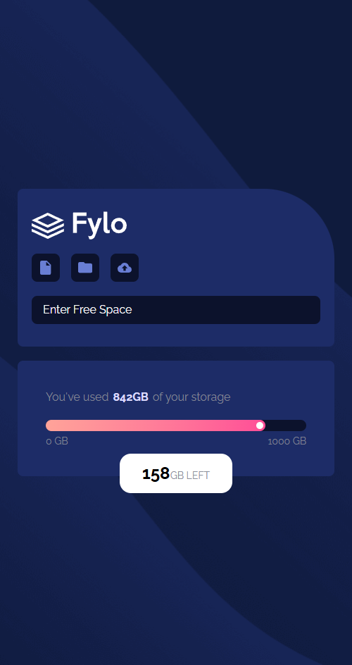

# Data Storage Component

## A responsive storage usage indicator with animated progress feedback

This project implements a data storage component that visually represents used and remaining storage based on user input. Users can enter the amount of available space, and the component dynamically calculates and displays how much storage has been used.

The interface includes a progress bar with a gradient fill and a movable indicator dot, providing clear visual feedback. Transitions are applied as values change, creating smooth updates as users type. The layout adapts seamlessly to different screen sizes, ensuring clarity and usability across devices.

### Screenshots

#### Image of the Desktop Design

#### Image of the Mobile Design

### Built with

- [React](https://react.dev/) - JS library
- [TypeScript](https://www.typescriptlang.org/) - type superset of JS
- [Tailwindcss](https://tailwindcss.com/) - utility-first CSS framework

## Author

- Website - [Mihailo Djurovic](portfolio-miahilo.vercel.app)
